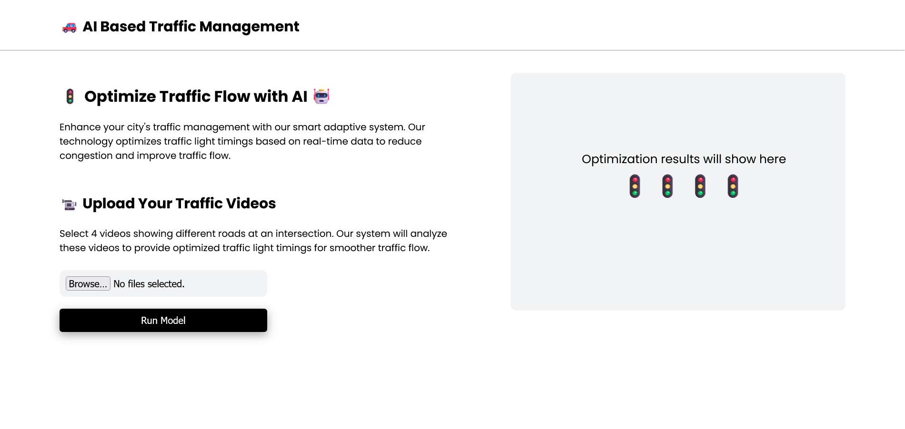
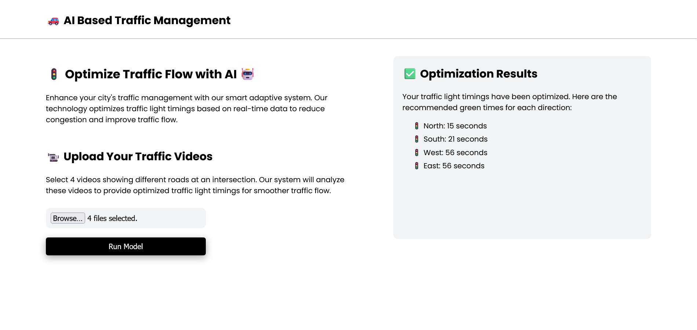



  <h1>🚦 Smart Adaptive Traffic Management System</h1>
  
An AI-powered traffic management solution utilizing Computer Vision and Genetic Algorithms to optimize intersection traffic flow.

## 📖 Overview

Traffic congestion is a rapidly growing problem in modern cities. The **Smart Adaptive Traffic Management System** tackles this issue by leveraging Artificial Intelligence and Computer Vision to dynamically adjust traffic signal timings based on real-time vehicle density. By analyzing live video feeds from intersection cameras, the system calculates the optimal green-light duration for each lane, significantly reducing wait times and improving overall traffic flow.

## 📸 Screenshots

### 1. Web Dashboard
*(Upload and manage traffic footage)*  

### 2. Live Video Analysis
*(Real-time computer vision processing and vehicle counting)*  

### 3. Optimization Results
*(Algorithmic feedback on optimal green-light timings)*  

## ✨ Key Features

- **Real-Time Vehicle Detection:** Utilizes the lightweight and fast **YOLOv4-tiny** object detection model combined with OpenCV to accurately count vehicles across incoming video feeds.
- **Dynamic Traffic Optimization:** Replaces static timers with an intelligent **Genetic Algorithm**. It computes the optimal green-signal allocation for each direction based on current congestion levels.
- **Interactive Web UI:** A sleek, responsive web interface built with **React.js**. Users can easily upload traffic footage, monitor the detection process, and view the final optimization reports.
- **Microservices Architecture:** A robust **Flask** backend handles video uploads, runs heavy machine learning models, and interacts with the frontend via API endpoints.

## 🛠️ Technologies Used

### Frontend
- **React.js:** UI component library
- **Axios:** Promise-based HTTP client for API networking
- **HTML5 & CSS3:** Structural markup and design

### Backend & API
- **Python 3:** Core programming language
- **Flask & Flask-CORS:** Development framework and cross-origin resource sharing handlers

### AI & Computer Vision
- **YOLOv4-tiny:** Compact, deep-learning-based object detection model (bounding boxes)
- **OpenCV (\cv2\):** Advanced image and video frame manipulation
- **NumPy & SciPy:** Arrays, mathematics, and high-level computations
- **Genetic Algorithm:** Deep optimization logic logic applied to phase shifting

## ⚙️ How It Works (Architecture Pipeline)

1. **Media Ingestion:** The user simultaneously uploads traffic videos (representing 4 intersection directions) via the React dashboard.
2. **Video Processing:** The Flask backend safely receives and routes the video streams to the local filesystem for processing.
3. **Object Detection:** OpenCV steps through the videos frame-by-frame while YOLOv4-tiny scans each frame, identifying and keeping a master count of the vehicles per lane.
4. **Optimization Engine:** The Genetic Algorithm determines the most efficient mathematical allocation of green light times, relying on vehicle head-counts to calculate clearance rates.
5. **Real-time Delivery:** The calculated timings are returned cleanly to the frontend rendering an output visualization table for the user.

## 🚀 Installation & Setup Guide

### 1. Prerequisites
Ensure you have the following installed on your operating system:
- **Node.js** (v14.x or higher) and **npm**
- **Python** (v3.8 or higher)
- **Git**

*(Note: The \yolov4-tiny.weights\ and \yolov4-tiny.cfg\ configuration files are pre-included in the \ackend/\ directory for fast out-of-the-box object detection).*

### 2. Clone the Repository
\\\ash
git clone https://github.com/NightCrawler909/smart-traffic-management.git
cd smart-traffic-management
\\\

### 3. Backend Setup
Open a terminal and set up the Python environment:
\\\ash
cd backend

# Create a virtual environment (optional but strongly recommended)
python -m venv venv

# Activate the virtual environment
# On Windows:
.\venv\Scripts\activate
# On macOS/Linux:
source venv/bin/activate

# Install required dependencies
pip install -r requirements.txt

# Start the Flask API server
python app.py
\\\
*The backend server should now be running on \http://localhost:5000\.*

### 4. Frontend Setup
Open a **new** terminal window and navigate to the frontend directory:
\\\ash
cd frontend

# Install Node modules
npm install

# Start the React development server
npm start
\\\
*The web application will open automatically in your default browser at \http://localhost:3000\.*

## 🚦 Usage Instructions

1. Ensure **both** the backend Python server and frontend React servers are actively running.
2. Open your browser and navigate to \http://localhost:3000\ (if it didn't open automatically).
3. Use the upload section to provide 4 traffic videos corresponding to the North, South, East, and West lanes of an intersection.
4. Click to start the analysis/processing sequence.
5. Observe the object detection visualizations process in the background and view the optimized green light duration outputs in the final results dashboard.

## 🙏 Acknowledgments

- **[Darknet / YOLOv4](https://github.com/AlexeyAB/darknet):** For the incredibly fast and precise object detection neural networks capabilities.
- **OpenCV Community:** For their vast suite of computer vision tools.

---
*Developed with ❤️ to build smarter, greener, and congestion-free cities.*
